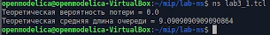
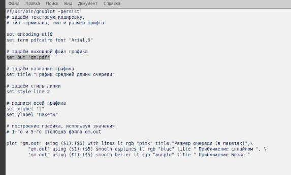
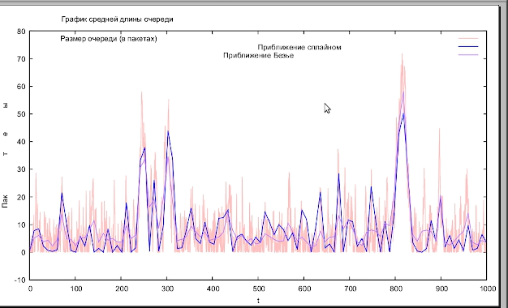

---
## Front matter
lang: ru-RU
title: Лабораторная работа № 3
subtitle: Моделирование стохастических процессов
author:
  - Шияпова Д.И.
institute:
  - Российский университет дружбы народов, Москва, Россия
date: 05 апреля 2025

## i18n babel
babel-lang: russian
babel-otherlangs: english

## Formatting pdf
toc: false
toc-title: Содержание
slide_level: 2
aspectratio: 169
section-titles: true
theme: metropolis
header-includes:
 - \metroset{progressbar=frametitle,sectionpage=progressbar,numbering=fraction}
---

## Докладчик

:::::::::::::: {.columns align=center}
::: {.column width="70%"}

  * Шияпова Дарина Илдаровна
  * Студентка
  * Российский университет дружбы народов
  * [1132226458@pfur.ru](mailto:1132226458@pfur.ru)

:::
::: {.column width="30%"}

:::
::::::::::::::

## Цель работы

Провести моделирование системы массового обслуживания (СМО).

## Задание

1. Реализовать модель $M|M|1$;
2. Посчитать загрузку системы и вероятность потери пакетов;
3. Построить график изменения размера очереди.

## Выполнение лабораторной работы

{#fig:001 width=70%}

## Выполнение лабораторной работы

{#fig:003 width=70%}

## Выполнение лабораторной работы

{#fig:004 width=70%}

## Выводы

В процессе выполнения данной лабораторной работы я провела моделирование системы массового обслуживания (СМО).
