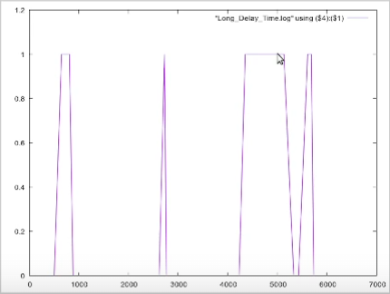

---
## Front matter
lang: ru-RU
title: Лабораторная работа № 11
subtitle: Модель системы массового обслуживания $M|M|1$
author:
  - Шияпова Д.И.
institute:
  - Российский университет дружбы народов, Москва, Россия
date: 05 апреля 2025

## i18n babel
babel-lang: russian
babel-otherlangs: english

## Formatting pdf
toc: false
toc-title: Содержание
slide_level: 2
aspectratio: 169
section-titles: true
theme: metropolis
header-includes:
 - \metroset{progressbar=frametitle,sectionpage=progressbar,numbering=fraction}
---


## Докладчик

:::::::::::::: {.columns align=center}
::: {.column width="70%"}

  * Шияпова Дарина Илдаровна
  * Студентка
  * Российский университет дружбы народов
  * [1132226458@pfur.ru](mailto:1132226458@pfur.ru)


:::
::: {.column width="30%"}


:::
::::::::::::::

## Цель работы

Реализовать модель $M|M|1$ в CPN tools.

## Задание

В систему поступает поток заявок двух типов, распределённый по пуассоновскому
закону. Заявки поступают в очередь сервера на обработку. Дисциплина очереди -
FIFO. Если сервер находится в режиме ожидания (нет заявок на сервере), то заявка
поступает на обработку сервером.


## Выполнение лабораторной работы


{#fig:002 width=70%}

## Выполнение лабораторной работы

{#fig:003 width=70%}

## Выполнение лабораторной работы

Зададим декларации системы.

Определим множества цветов системы (colorset):

- фишки типа `UNIT` определяют моменты времени;
- фишки типа `INT` определяют моменты поступления заявок в систему.
- фишки типа `JobType` определяют 2 типа заявок — A и B;
- кортеж `Job` имеет 2 поля: jobType определяет тип работы (соответственно имеет тип `JobType`, поле `AT` имеет тип `INT` и используется для хранения времени нахождения заявки в системе);
- фишки `Jobs` — список заявок;
- фишки типа `ServerxJob` — определяют состояние сервера, занятого обработкой
заявок.

## Выполнение лабораторной работы

Переменные модели:

- `proctime` — определяет время обработки заявки;
- `job` — определяет тип заявки;
- `jobs` — определяет поступление заявок в очередь.

## Выполнение лабораторной работы

Определим функции системы:

- функция `expTime` описывает генерацию целочисленных значений через интервалы времени, распределённые по экспоненциальному закону;
- функция `intTime` преобразует текущее модельное время в целое число;
- функция `newJob` возвращает значение из набора `Job` — случайный выбор типа
заявки (A или B).

## Выполнение лабораторной работы

{#fig:004 width=70%}


## Выполнение лабораторной работы

{#fig:005 width=70%}


## Выполнение лабораторной работы

{#fig:006 width=70%}


## Выполнение лабораторной работы

{#fig:007 width=70%}


## Выполнение лабораторной работы

{#fig:008 width=70%}

## Выполнение лабораторной работы

{#fig:009 width=70%}
 

## Выполнение лабораторной работы

{#fig:010 width=70%}

## Выполнение лабораторной работы
```
#!/usr/bin/gnuplot -persist
# задаём текстовую кодировку,
# тип терминала, тип и размер шрифта

set encoding utf8
set term pngcairo font "Helvetica,9"

# задаём выходной файл графика
set out 'window_1.png'
plot "Queue_Delay.log" using ($4):($1) with lines
```
## Выполнение лабораторной работы
{#fig:011 width=70%}

## Выполнение лабораторной работы

{#fig:012 width=70%}

## Выполнение лабораторной работы
{#fig:013 width=70%}

## Выполнение лабораторной работы

{#fig:014 width=70%}

## Выполнение лабораторной работы.

{#fig:015 width=70%}

## Выполнение лабораторной работы

{#fig:016 width=70%}


## Выполнение лабораторной работы

```
#!/usr/bin/gnuplot -persist
# задаём текстовую кодировку,
# тип терминала, тип и размер шрифта

set encoding utf8
set term pngcairo font "Helvetica,9"

# задаём выходной файл графика
set out 'window_1.png'
set style line 2
plot [0:] [0:1.2] "Long_Delay_Time.log" using ($4):($1) with lines
```


## Выполнение лабораторной работы
{#fig:017 width=70%}

## Выводы

В процессе выполнения данной лабораторной работы я реализовала модель системы массового обслуживания $M|M|1$ в CPN Tools.
