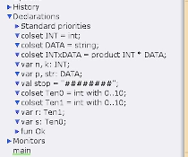
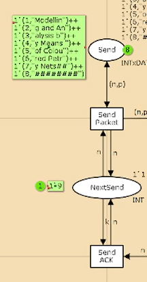
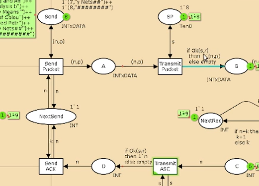
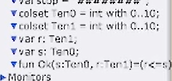
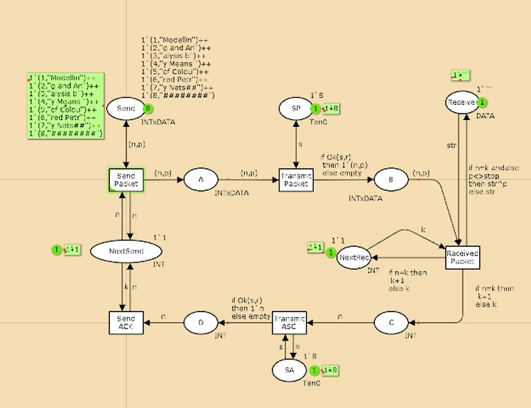
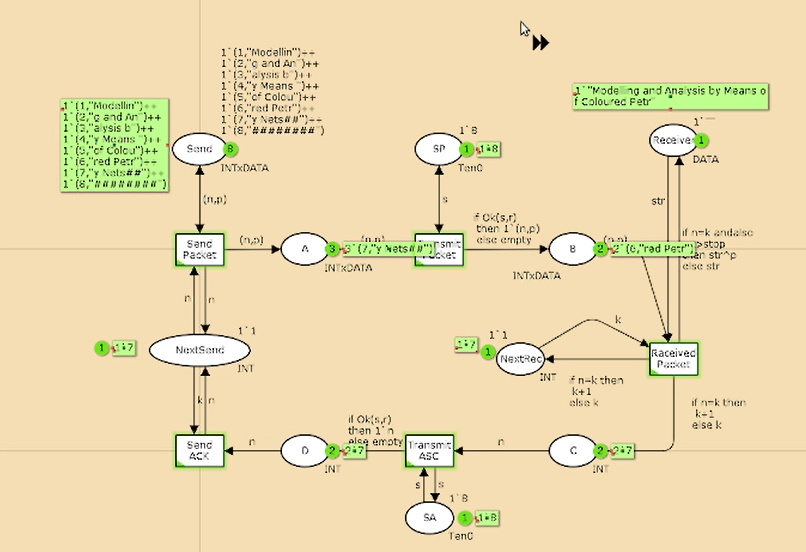
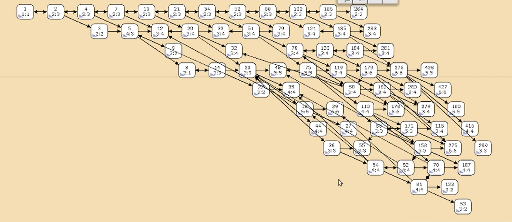

---
## Front matter
lang: ru-RU
title: Лабораторная работа № 12
subtitle: Пример моделирования простого протокола передачи данных
author:
  - Шияпова Д.И.
institute:
  - Российский университет дружбы народов, Москва, Россия
date: 05 апреля 2025

## i18n babel
babel-lang: russian
babel-otherlangs: english

## Formatting pdf
toc: false
toc-title: Содержание
slide_level: 2
aspectratio: 169
section-titles: true
theme: metropolis
header-includes:
 - \metroset{progressbar=frametitle,sectionpage=progressbar,numbering=fraction}
---

## Докладчик

:::::::::::::: {.columns align=center}
::: {.column width="70%"}

  * Шияпова Дарина Илдаровна
  * Студентка
  * Российский университет дружбы народов
  * [1132226458@pfur.ru](mailto:1132226458@pfur.ru)

:::
::: {.column width="30%"}

:::
::::::::::::::

## Цели и задачи

Реализовать простой протокол передачи данных в CPN Tools.

## Цели и задачи

- Реализовать простой протокол передачи данных в CPN Tools.
- Вычислить пространство состояний, сформировать отчет о нем и построить граф.

## Выполнение лабораторной работы

{#fig:001 width=70%}

## Выполнение лабораторной работы
{#fig:002 width=70%}

## Выполнение лабораторной работы

{#fig:003 width=70%}

## Выполнение лабораторной работы

{#fig:004 width=70%}

## Выполнение лабораторной работы

{#fig:005 width=70%}

## Выполнение лабораторной работы

{#fig:006 width=70%}

## Упражнение

Вычислим пространство состояний. Прежде, чем пространство состояний может быть вычислено и проанализировано, необходимо сформировать код пространства состояний. Этот код создается, когда используется инструмент Войти в пространство состояний. Вход в пространство состояний занимает некоторое время. Затем, если ожидается, что пространство состояний будет небольшим, можно просто применить инструмент Вычислить пространство состояний к листу, содержащему страницу сети. Сформируем отчёт о пространстве состояний и проанализируем его.  Чтобы сохранить отчет, необходимо применить инструмент Сохранить отчет о пространстве состояний к листу, содержащему страницу сети и ввести имя файла отчета.

## Упражнение

Из него можно увидеть:

- 13341 состояний и 206461 переходов между ними.
- Указаны границы значений для каждого элемента: промежуточные состояния A, B, C(наибольшая верхняя граница у A, так как после него пакеты отбрасываются. Так как мы установили максимум 10, то у следующего состояния B верхняя граница -- 10), вспомогательные состояния SP, SA, NextRec, NextSend, Receiver(в них может находиться только один пакет) и состояние Send(в нем хранится только 8 элементов, так как мы задали их в начале и с ними никаких изменений не происходит).
- Указаны границы в виде мультимножеств.
- Маркировка home для всех состояний (в любую позицию можно попасть из любой другой маркировки).
- Маркировка dead равная 4675 [9999,9998,9997,9996,9995,...] -- это состояния, в которых нет включенных переходов.

## Упражнение

{#fig:007 width=70%}

## Выводы

В процессе выполнения данной лабораторной работы я реализовала простой протокол передачи данных в CPN Tools и проведен анализ его пространства состояний.
